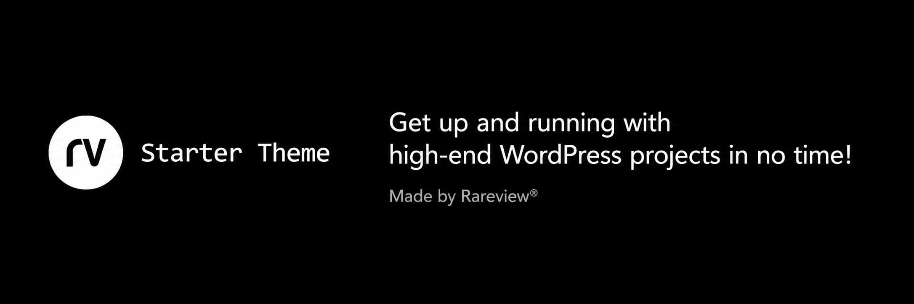

# RV Starter Theme



Modern WordPress starter theme for fast, scalable builds.
- Based on the 10up Scaffold Theme
- Follows WP VIP coding standards and best practices
- Supports WP VIP and WPE platforms
- Supports fast global styles setup
	- 130+ variables covering global styles
	- One-command Figma global styles sync
	- Gutenberg compatibility out of the box
	- Fluid responsiveness out of the box
	- Consistent appearance between frontend and block editor
- Uses the latest PHP without complex templating languages
- Built with SEO and accessibility in mind
- Translation-ready
- And much more!

## Requirements

- PHP >= 8.2
- Node >= 20
- NPM >= 10
- [Lando](https://lando.dev) v3.25.6+ (recommended)
- [Docker Desktop](https://www.docker.com/products/docker-desktop/) (Mac/Windows)

## Clone a Repo

First, create a new repository from one of the options below and clone it to your local machine:
- For **WP VIP** projects, use [wp-vip-starter](https://github.com/rareview/wp-vip-starter) repo as a template.<br>
- For **WPEngine** projects, use [wpe-starter](https://github.com/rareview/wpe-starter) repo as a template.<br>
- For platform-independent WP projects, you can use this repo as a template (Lando-based).
- Clone a newly created repo to your local machine.
  <br><br>

<hr>

## Initial Setup
After cloning your new repo locally, run the interactive setup script:

```bash
npm run setup
```

This handles all renaming, rebranding, and configuration automatically:
- Renames the theme directory, translation files, and all references
- Performs case-sensitive find-and-replace across all project files
- Updates Lando config, deploy scripts, and CI workflows
- Generates a project-specific `AGENTS.md` for AI-assisted development
- Optionally runs `npm install` and `lando start`

For CI or non-interactive use: `npm run setup -- --yes`
To preview changes: `npm run setup -- --dry-run`

<hr>

## Figma Global Styles Sync
This theme uses SCSS variables and mixins to power global styles. You can update values manually (see the variable mapping guide in [Local Development Setup](.local/docs/local-development-setup.md)), or run the Figma sync command by providing a Figma file URL. The sync automatically pulls common design tokens such as typography styles (headings/body), buttons, links, color palette, and container width.

```bash
npm run figma-sync
```
___________________________________________________________

## Local Environment Setup

See [Local Development Setup](.local/docs/local-development-setup.md) for details.

## Theme Development

See [Theme Development](.local/docs/theme-development.md) for details.
